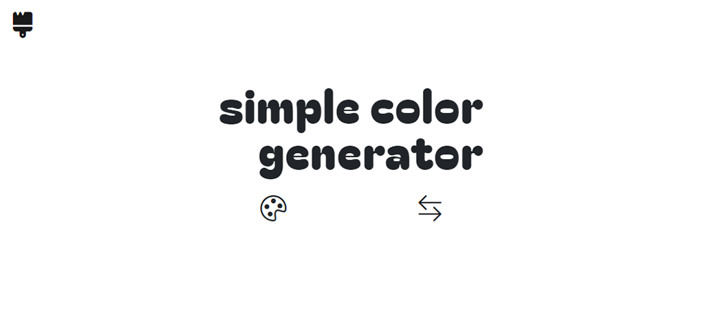

# Color Generator

## [live site](https://jacqueschuis.github.io/simple-color-generator/)

## Table of Contents

- [Overview](#overview)
- [Challenges](#challenges)
    - [UI Redesign](#redesign)
- [Things to Add](#things-to-add)
- [Author](#author)

## Overview

This color generator is the first app that I ever built. As I was following along with Colt Steele's Web Developer Bootcamp, there was a project to build a simple RGB color generator, demonstrating the basic ideas behind DOM manipulation with vanilla JS. I built this alongside him, and then I gave myself the challenge to make this work with Hex colors as well. To simplify the code, I ended up making a class constructor function to handle all things color (which goes deeper than is currently used here). Based on this Color function, I can then easily set the text of the app.

I initially built this in the fall of 2022, but I revisited in summer 2023, rehauling the design of the app to fit with my current style. All of the same functionality is there, but things are (I'd like to think) much clearer now, and the code is simpler and more efficient than it was previously.

## Challenges

### Redesign

Because I had set the app down for quite a long time, revisiting it was a little tough. I hadn't made my functions very clear, and it took me a good bit of experimenting to find out exactly what I was doing. I changed the functions to rely on a constructor for Colors, and this clarifies things immensely. 

I also am revisiting this after building my portfolio in React and Tailwind, so going to Vanilla JS and Bootstrap again took a second. I had to reference the docs (especially for Bootstrap) very frequently, and eventually, I would like to bring this app into the Tailwind world.

## Things to Add

1. Add features

This app is very simple. You make a 3-stop monochromatic scheme with the click of a button, which definitely serves its purpose, but it is not the comprehensive tool which I would like it to be. I would like to add options for different color schemes (i.e., complementary, tertiary, triadic, etc.)

2. Copy to clipboard

I need to learn more about the Clipboard API to make this more functional. It is all well-and-good to generate random colors, but for it to be more functional, the user should be able to copy the colors to a clipboard to paste wherever they may be using them.

3. Download scheme

I would like to be able to export the scheme card to an image that the client can download for referencing later.

4. History

I would like there to be some sort of history functionality whereby the app remembers your 5 or so most recent colors, and there's an option to save/pin these using local memory.

5. Transfer the app to a new framework

To deal with the added complexities which I would like to add, I will likely need this to be built on a framework, like React. 

## Author

This website was created from scratch by me, [Jacques Pariseau](https://j-par.com).
